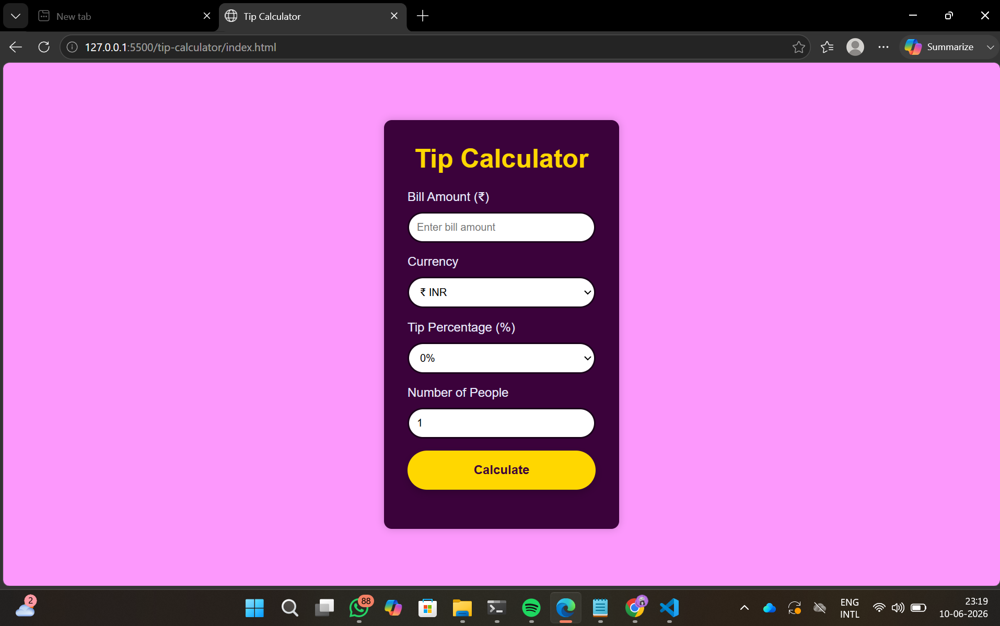
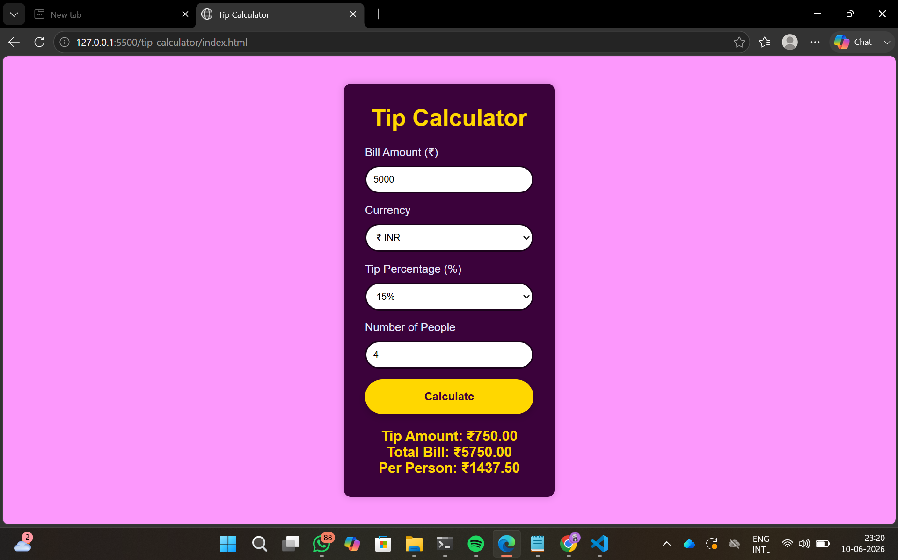

Tip Calculator : A simple tip calculator built using HTML, CSS, and JavaScript.

Screenshot:  

Features:
- Calculate tip amount
- Split bill among people
- Tip percentage dropdown
- Responsive design

Technologies Used:
- HTML
- CSS
- JavaScript
